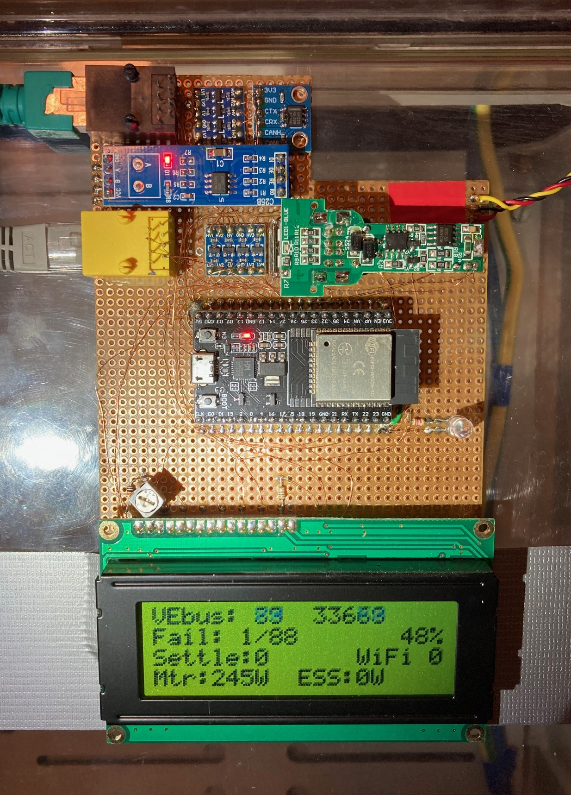

# Victron Multiplus 2 ESS using ESP32-DevKitC V4 controlling VE.Bus

Implements an ESS system with Victron Multiplus II and Pylontech batteries.
The Multiplus is directly controlled via VE.Bus using a custom ESP32 board,
which features built-in CAN and RS485 transceivers.



## Hardware Requirements

- **Custom ESP32 Board based on ESP32-DevKitC V4**
  - ESP32-WROOM-32D microcontroller
  - MAX485 RS485 transceiver for VE.Bus communication
  - SN65HVD230 CAN bus transceiver for battery communication
  - LC Display 4x20 HD44780 for status display
  - Optical impulse receiver for power meter integration
  - DC-DC step-down regulator (7-12V to 5V) for power supply
  - RJ45 connectors for VE.Bus and CAN bus
  - WiFi & Bluetooth support
  - USB programming

## Pin Configuration (LilyGO T-CAN485)

```
CAN Bus (for Pylontech batteries):
- CAN_TX: GPIO4
- CAN_RX: GPIO5

VE.Bus (RS485 for Victron communication):
- RS485_TX: GPIO17
- RS485_RX: GPIO16  
- RS485_DE: GPIO21 (Direction Enable)

Status LED:
- WS2812 LED: GPIO4
```

## Description

This ESS control code works for two famous Multiplus II wiring configurations:
For systems where the Multiplus is only connected with ACin, as well as for
systems with emergency power where the Multiplus is connected to ACin and
ACout2.

In ACout2 configuration, input from an elecric meter might not even be
required, as the ESS assistant inside the Multiplus will automatically
compensate energy on ACout2 from/into the battery to always maintain 0W power
at ACin if possible. Assuming it gets periodic 0W commands from this code via
the [VE.Bus](#vebus).

Input from an electric meter is needed if power is also sourced (or feed-in)
in front of the Multiplus device, meaning in parallel to ACin or connected to
other electrical phases, if one whishes to also compensate this energy to let
a totalizing power meter show zero.

In a conventional ESS system an additional electric meter is required to be
installed. This code can use the optical 1/10000kWh impulse output that most
official digital meters already have.

Note that currently this code only supports a single Multiplus device (single-
phase). In the future it might be extended to also control a three-phase
Multiplus system. If interested in this, read [here](docs/README.md#improvements).

## VE.Bus

For hardware details read my documentation [here](docs/README.md#max485-converter-for-vebus).

For software details read my documentation [here](docs/README.md#vebus).

## Getting Started

### Dependencies

This project uses PlatformIO for development. All required libraries are automatically 
managed through PlatformIO's library dependency system.

**Required:**
- PlatformIO Core or PlatformIO IDE
- LilyGO T-CAN485 board

### Hardware Setup

1. **Custom ESP32 Board**: Based on ESP32-DevKitC V4 with integrated transceivers
2. **Pylontech Battery Connection**: Connect CAN+ and CAN- to the battery's CAN bus (RJ45)
3. **Victron Multiplus Connection**: Connect RS485 A/B to VE.Bus terminals (RJ45)
4. **Power Supply**: 7-12V input via DC-DC regulator from Multiplus VE.Bus (max. 700mW)
5. **LC Display**: Connect 4x20 HD44780 display for local monitoring
6. **Optical Sensor**: Mount IR receiver in front of electricity meter for consumption monitoring
7. **Status LED**: Connect WS2812 LED for power flow visualization

### Software Installation

```bash
# Clone the repository
git clone https://github.com/mkrasselt1/victron-esp32-ess-homeassitant.git
cd victron-esp32-ess-homeassitant

# Install dependencies and build
pio run

# Upload firmware (first time via USB)
pio run -t upload

# Monitor serial output
pio device monitor
```

### WiFi Configuration

The device uses WiFiManager for easy WiFi setup:

1. On first boot, the device creates a WiFi access point "VictronESS-Setup"
2. Connect to this network with your phone/computer
3. Open browser and navigate to 192.168.4.1
4. Select your WiFi network and enter credentials
5. Device will connect and remember the settings

### MQTT Configuration

After WiFi setup, configure MQTT for remote monitoring and control:

1. Access the web interface at the device IP
2. Click "MQTT konfigurieren" in the MQTT Status card
3. Enter your MQTT broker details (server, port, credentials)
4. The device will publish system data and accept control commands

**MQTT Topics:**
- **Publishing:** `ess/battery/soc`, `ess/battery/voltage`, `ess/battery/power`, `ess/multiplus/power`, `ess/feedin/enabled`, `ess/feedin/target`
- **Subscribing:** `ess/feedin/enabled`, `ess/feedin/target`, `ess/feedin/max`

### Over-The-Air (OTA) Updates

After initial setup, you can update firmware wirelessly:

1. Find device IP address in serial monitor
2. Edit `platformio.ini`:
   ```ini
   ; Uncomment and set your device's IP
   upload_protocol = espota
   upload_port = 192.168.1.100  ; Your device IP
   ```
3. Upload wirelessly:
   ```bash
   pio run -t upload
   ```

### Installing
### Configuration Steps

* Ensure your LilyGO T-CAN485 board is properly connected to Pylontech batteries (CAN bus) and Victron Multiplus (VE.Bus)
* Update your Victron Multiplus II to latest firmware using an MK3 interface (tested with v502 on Multiplus II 48/5000)
* Configure your Multiplus with ESS assistant and correct voltage thresholds matching your battery
* Clone this repository and upload firmware using PlatformIO
* Use WiFiManager for initial WiFi setup (access point "VictronESS-Setup")
* Access web interface at device IP for monitoring and control

## Features

* **WiFiManager**: Automatic WiFi configuration with captive portal
* **OTA Updates**: Both PlatformIO and web-based firmware updates
* **CAN Bus**: Dedicated task for Pylontech battery communication
* **VE.Bus**: Separate task for Victron Multiplus control
* **Status LED**: WS2812 LED with power flow visualization
* **Web API**: REST API for system monitoring and control
* **Real-time Monitoring**: Live system status via web interface with WebSocket updates
* **MQTT Integration**: Publish system data and subscribe to control commands
* **Feed-in Power Control**: Automatic power feed-in regulation with configurable targets
* **SPIFFS Storage**: Persistent configuration storage for MQTT settings
* **Battery Protection**: Advanced monitoring of battery protection and warning flags
* **Memory Optimized**: Efficient code design for stable ESP32 operation

## Authors

Contributors names and contact info

Baxi (pv-baxi@gmx.de)

## Version History

* 1.0
    * Complete hardware redesign with custom ESP32-DevKitC V4 board
    * Added MQTT integration with web-based configuration
    * Implemented feed-in power control system
    * Added WebSocket support for real-time updates
    * Integrated LC display for local monitoring
    * Added optical power meter interface
    * Enhanced web interface with comprehensive system metrics
    * Memory optimization for stable ESP32 operation
    * SPIFFS-based configuration persistence
* 0.1
    * Initial Release with LilyGO T-CAN485 board

## License

This project is licensed under the GNU General Public License v3.0 or later - see the LICENSE.md file for details

## Acknowledgments

* [VictronEnergy] (https://www.victronenergy.com/upload/documents/Technical-Information-Interfacing-with-VE-Bus-products-MK2-Protocol-3-14.pdf)
* [wkirby] (https://community.victronenergy.com/questions/64847/rj45-wires-used-by-vebus-pin-out.html)
* [ASCIIart] (https://patorjk.com/software/taag/#p=display&f=Standard&t=)
* [LiquidCrystal] (https://github.com/arduino-libraries/LiquidCrystal)
* [WebServer] (https://github.com/espressif/arduino-esp32/tree/master/libraries/WebServer)
* [ESPmDNS] (https://github.com/espressif/arduino-esp32/tree/master/libraries/ESPmDNS)
* [TWAI] (https://github.com/espressif/arduino-esp32/tree/master/libraries/ESP32/examples/TWAI)
* [Civilduino] (https://github.com/espressif/arduino-esp32/issues/3921)
* [Hadmut] (https://www.mikrocontroller.net/topic/561834)
* [SWeigert] (http://www.stefan-weigert.de/php_loader/sml.php)
* [SDraeger] (https://draeger-it.blog/zutrittskontrolle-mit-nummernfeld-esp32-und-shelly/)
* [ESPAsyncWebServer] (https://github.com/me-no-dev/ESPAsyncWebServer)
* [ArduinoJson] (https://github.com/bblanchon/ArduinoJson)
* [PubSubClient] (https://github.com/knolleary/pubsubclient)

